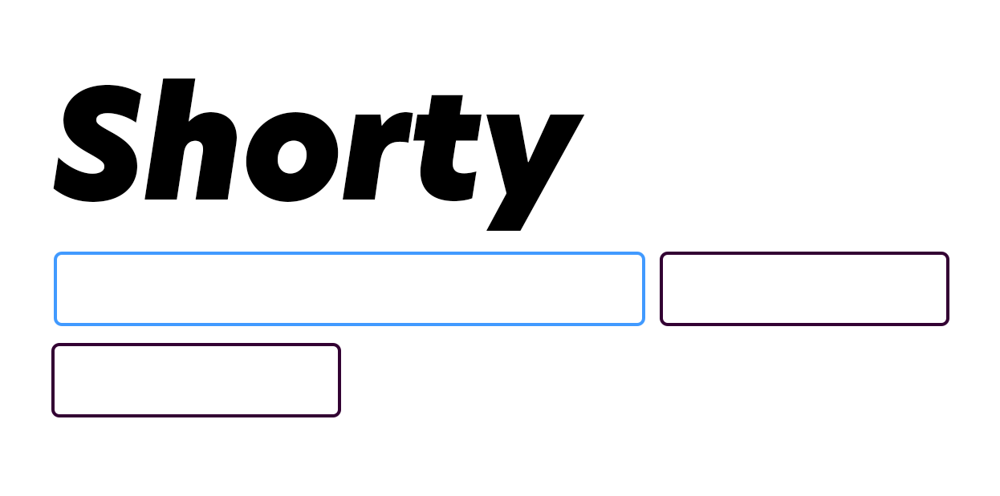

# Shorty 🥞

An easily recreatable branded shortened URL generator.



## Getting Started

### Requirements

- [NodeJS]("https://nodejs.com")
- [MongoDB]("https://mongodb.com")

[include a bulleted list of any dependencies your project requires. Include links to the dependencies, and additionally links to helpful resources to get up and running with the project's dependencies]

### Installation

Clone repo

```````
git clone https://github.com/johnhodge/shorty.git
```````

Add `.env` file with MongoDB to project root.

``````
cd shorty; echo "MONGODB_URI='{{INSERT MONGDO DB URL HERE}}'" > .env
``````

Install dependencies and launch development environment

``````
npm install && debug=true npm run dev
``````

Customize as much as you like and push to production.

## Options

- Shorty can be extended with additional security and user authentication support with MongoDB Realm (or through several other methods/middlewears).
- API rate limiting has been imposed and can be tweaked as needed.
- Error messages can be customized via Yup.
- Shorty will work with a variety of deployment services and has been battle tested with Heroku.

## Resources

### Articles, Tutorials, etc

- [MongoDB Realm]("https://docs.mongodb.com/realm/tutorial")
- [Express API reference]("https://expressjs.com/en/api.html")
- [API rate limiting with Express]("https://www.npmjs.com/package/express-rate-limit")
- [Deploy NodeJS to Heroku]("https://devcenter.heroku.com/articles/deploying-nodejs")
- [Yup docs]("https://www.npmjs.com/package/yup")

### Support

<https://github.com/johnhodge/shorty/issues>

### Contributing and Contact

Shorty is accepting PRs for your brilliant ideas.
